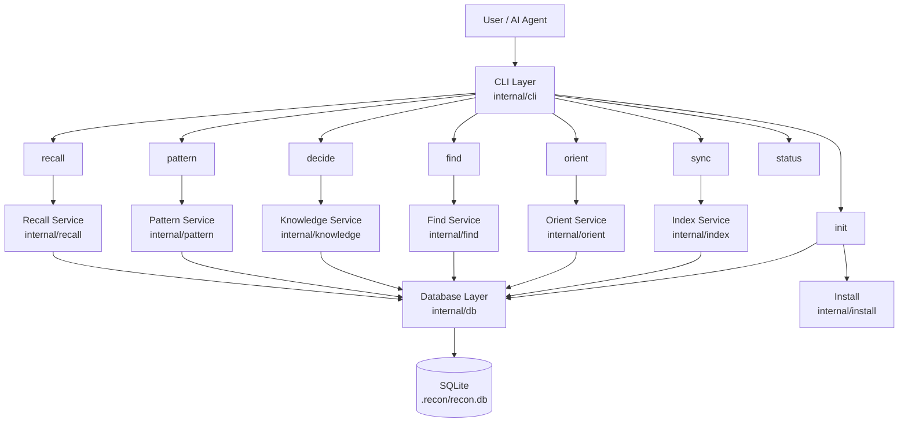
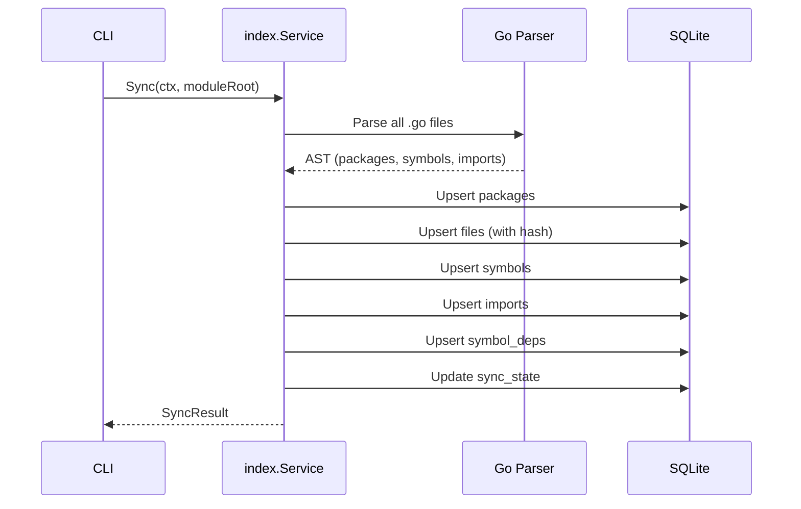
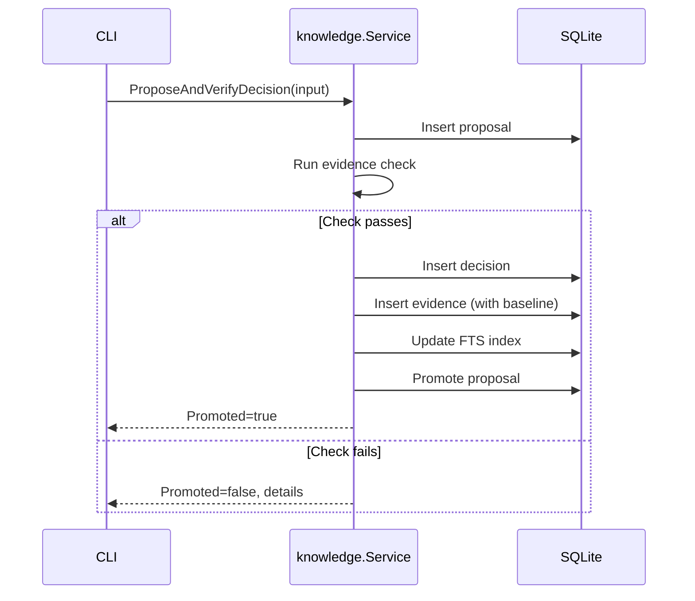
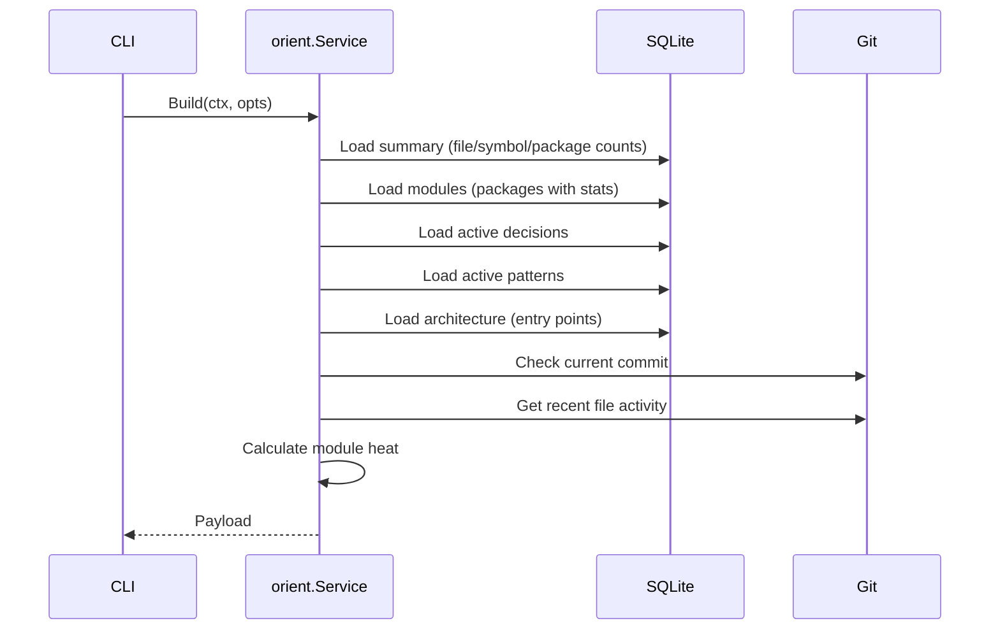

# Architecture

Recon is a Go CLI tool that indexes Go source code into a local SQLite database
and provides commands for navigation, search, knowledge recording, and
orientation.

## System Overview



## Entry Point

`cmd/recon/main.go` is the binary entry point. It delegates to
`internal/cli.NewRootCommand()` which builds a Cobra command tree with 8
subcommands. The entry point handles exit codes via `cli.ExitError`.

## Layers

### CLI Layer (`internal/cli/`)

The CLI layer owns user interaction: argument parsing, output formatting, and
error presentation. Each command file (`init.go`, `sync.go`, `find.go`, etc.)
defines a Cobra command with its flags and `RunE` handler.

Key responsibilities:

- Parse flags and arguments
- Open the database via `openExistingDB()`
- Call the appropriate domain service
- Format output (text or JSON via `output.go`)
- Return structured errors (`ExitError`, JSON error envelopes)

The CLI layer does not contain business logic. It's a thin adapter between user
input and domain services.

### Domain Services (`internal/`)

Each domain has its own package with a `Service` struct that wraps `*sql.DB`:

| Package              | Service             | Responsibility                                                     |
| -------------------- | ------------------- | ------------------------------------------------------------------ |
| `internal/index`     | `index.Service`     | Parse Go files, extract symbols/imports/deps, upsert into DB       |
| `internal/find`      | `find.Service`      | Symbol lookup, list mode, package listing                          |
| `internal/knowledge` | `knowledge.Service` | Decision lifecycle: propose, verify, promote, update, archive      |
| `internal/pattern`   | `pattern.Service`   | Pattern lifecycle: propose, verify, promote                        |
| `internal/recall`    | `recall.Service`    | Full-text search across decisions and patterns                     |
| `internal/orient`    | `orient.Service`    | Aggregate project context (summary, architecture, heat, decisions) |

Each service owns its SQL queries directly — there is no ORM, no shared query
builder, and no repository abstraction. This keeps queries co-located with the
logic that uses them.

### Database Layer (`internal/db/`)

- `db.go` — SQLite connection management using `modernc.org/sqlite` (pure-Go
  driver). Opens with `MaxOpenConns(1)` and `PRAGMA foreign_keys = ON`.
- `migrate.go` — Schema migrations using `golang-migrate`.
- `migrations/` — Numbered SQL migration files (up/down).
- `sync_state.go` — Sync state management (last sync time, commit, fingerprint).

The database lives at `<module-root>/.recon/recon.db`.

### Install Layer (`internal/install/`)

Handles Claude Code integration file installation:

- `InstallHook()` — Writes the SessionStart hook script
- `InstallSkill()` — Writes the `/recon` skill definition
- `InstallSettings()` — Configures hooks in `.claude/settings.json`
- `InstallClaudeSection()` — Appends/updates the Recon section in `CLAUDE.md`

Uses `embed.FS` to bundle asset files into the binary.

## Data Flow

### Indexing (`recon sync`)



### Decision Recording (`recon decide`)



### Orient Context (`recon orient`)



## Key Design Decisions

### Pure-Go SQLite

Using `modernc.org/sqlite` instead of `mattn/go-sqlite3` because:

- No CGO dependency — builds anywhere Go builds
- Single binary distribution with no native library requirements
- Slightly slower but acceptable for local CLI usage

### No ORM

Each service writes raw SQL queries. This provides:

- Full control over query optimization
- No abstraction leakage
- Queries are co-located with the logic that uses them
- Easy to understand and debug

### Function-Var Injection

Testability is achieved via package-level function variables:

```go
var osGetwd = os.Getwd

// In tests:
osGetwd = func() (string, error) { return "/mock/path", nil }
```

This avoids interfaces and dependency injection frameworks while keeping tests
isolated.

### Agent-First Design

Recon is designed primarily for AI coding agents:

- All commands support `--json` for machine-readable output
- `--no-prompt` disables interactive prompts for non-interactive use
- `--json-strict` suppresses warnings that could confuse JSON parsers
- The orient payload provides everything an agent needs to start working
- The SessionStart hook auto-injects context

### Single-File Database

SQLite with a single `.recon/recon.db` file means:

- No server to run or configure
- No network dependencies
- Database is local to the project
- Easy to reset (`rm .recon/recon.db`)
- Gitignored by default

## Module Structure

All code lives in `internal/` — nothing is exported outside the module. The
public surface is the CLI binary only.

```
cmd/recon/main.go          → Entry point
internal/cli/              → CLI commands (Cobra)
internal/db/               → Database management
internal/index/            → Code indexing
internal/find/             → Symbol search
internal/knowledge/        → Decision management
internal/pattern/          → Pattern management
internal/recall/           → Knowledge retrieval
internal/orient/           → Context aggregation
internal/install/          → Claude Code integration
```
