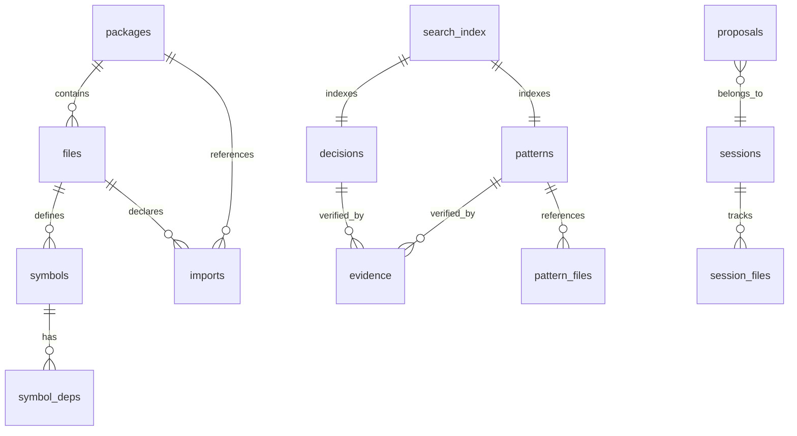

# Database Schema

Recon uses SQLite for local storage at `<module-root>/.recon/recon.db`. The
schema is managed by golang-migrate with numbered migration files in
`internal/db/migrations/`.

## Entity Relationship Overview

## Code Tables

### packages

Indexed Go packages in the module.

| Column        | Type    | Constraints     | Description                    |
| ------------- | ------- | --------------- | ------------------------------ |
| `id`          | INTEGER | PRIMARY KEY     | Auto-increment ID              |
| `path`        | TEXT    | UNIQUE NOT NULL | Relative path from module root |
| `name`        | TEXT    | NOT NULL        | Go package name                |
| `import_path` | TEXT    |                 | Full import path               |
| `file_count`  | INTEGER | DEFAULT 0       | Number of Go files             |
| `line_count`  | INTEGER | DEFAULT 0       | Total lines of code            |
| `created_at`  | TEXT    | NOT NULL        | ISO 8601 timestamp             |
| `updated_at`  | TEXT    | NOT NULL        | ISO 8601 timestamp             |

### files

Individual Go source files.

| Column       | Type    | Constraints      | Description                       |
| ------------ | ------- | ---------------- | --------------------------------- |
| `id`         | INTEGER | PRIMARY KEY      | Auto-increment ID                 |
| `package_id` | INTEGER | FK → packages.id | Owning package                    |
| `path`       | TEXT    | UNIQUE NOT NULL  | Relative file path                |
| `language`   | TEXT    | DEFAULT 'go'     | File language                     |
| `lines`      | INTEGER | NOT NULL         | Line count                        |
| `hash`       | TEXT    | NOT NULL         | Content hash for change detection |
| `created_at` | TEXT    | NOT NULL         | ISO 8601 timestamp                |
| `updated_at` | TEXT    | NOT NULL         | ISO 8601 timestamp                |

### symbols

Go symbols extracted from source files.

| Column       | Type    | Constraints                     | Description                                           |
| ------------ | ------- | ------------------------------- | ----------------------------------------------------- |
| `id`         | INTEGER | PRIMARY KEY                     | Auto-increment ID                                     |
| `file_id`    | INTEGER | FK → files.id ON DELETE CASCADE | Source file                                           |
| `kind`       | TEXT    | NOT NULL                        | Symbol kind: `func`, `method`, `type`, `var`, `const` |
| `name`       | TEXT    | NOT NULL                        | Symbol name                                           |
| `signature`  | TEXT    |                                 | Function/method signature                             |
| `body`       | TEXT    |                                 | Full source body                                      |
| `line_start` | INTEGER | NOT NULL                        | Starting line number                                  |
| `line_end`   | INTEGER | NOT NULL                        | Ending line number                                    |
| `exported`   | INTEGER | NOT NULL                        | 1 if exported, 0 if unexported                        |
| `receiver`   | TEXT    | DEFAULT ''                      | Method receiver type (empty for non-methods)          |

Unique constraint: `(file_id, kind, name, receiver)` — no duplicate symbols
within the same file.

### imports

File-level import declarations.

| Column          | Type    | Constraints                     | Description                     |
| --------------- | ------- | ------------------------------- | ------------------------------- |
| `id`            | INTEGER | PRIMARY KEY                     | Auto-increment ID               |
| `from_file_id`  | INTEGER | FK → files.id ON DELETE CASCADE | Importing file                  |
| `to_path`       | TEXT    | NOT NULL                        | Import path                     |
| `to_package_id` | INTEGER | FK → packages.id                | Resolved local package (if any) |
| `alias`         | TEXT    |                                 | Import alias (if renamed)       |
| `import_type`   | TEXT    | NOT NULL                        | Import type classification      |

Unique constraint: `(from_file_id, to_path)` — one import per path per file.

### symbol_deps

Symbol-level dependency relationships. Tracks which symbols a given symbol
references.

| Column        | Type    | Constraints                       | Description                 |
| ------------- | ------- | --------------------------------- | --------------------------- |
| `id`          | INTEGER | PRIMARY KEY                       | Auto-increment ID           |
| `symbol_id`   | INTEGER | FK → symbols.id ON DELETE CASCADE | Source symbol               |
| `dep_name`    | TEXT    | NOT NULL                          | Referenced symbol name      |
| `dep_package` | TEXT    | DEFAULT ''                        | Referenced symbol's package |
| `dep_kind`    | TEXT    | DEFAULT ''                        | Referenced symbol's kind    |

Unique constraint: `(symbol_id, dep_name, dep_package, dep_kind)`.

**Note:** `dep_package` and `dep_kind` were added in migration 002 to provide
richer dependency context.

## Knowledge Tables

### decisions

Architectural decisions recorded with evidence.

| Column       | Type    | Constraints      | Description                |
| ------------ | ------- | ---------------- | -------------------------- |
| `id`         | INTEGER | PRIMARY KEY      | Auto-increment ID          |
| `title`      | TEXT    | NOT NULL         | Decision title             |
| `reasoning`  | TEXT    | NOT NULL         | Why this decision was made |
| `confidence` | TEXT    | DEFAULT 'medium' | `low`, `medium`, `high`    |
| `status`     | TEXT    | DEFAULT 'active' | `active` or `archived`     |
| `created_at` | TEXT    | NOT NULL         | ISO 8601 timestamp         |
| `updated_at` | TEXT    | NOT NULL         | ISO 8601 timestamp         |

### patterns

Recurring code patterns with evidence.

| Column        | Type    | Constraints      | Description             |
| ------------- | ------- | ---------------- | ----------------------- |
| `id`          | INTEGER | PRIMARY KEY      | Auto-increment ID       |
| `title`       | TEXT    | NOT NULL         | Pattern title           |
| `description` | TEXT    | DEFAULT ''       | Pattern description     |
| `confidence`  | TEXT    | DEFAULT 'medium' | `low`, `medium`, `high` |
| `status`      | TEXT    | DEFAULT 'active' | `active` or `archived`  |
| `created_at`  | TEXT    | NOT NULL         | ISO 8601 timestamp      |
| `updated_at`  | TEXT    | NOT NULL         | ISO 8601 timestamp      |

### evidence

Verification evidence linked to decisions or patterns. Each evidence row
contains a check specification and tracks drift.

| Column             | Type    | Constraints  | Description                                       |
| ------------------ | ------- | ------------ | ------------------------------------------------- |
| `id`               | INTEGER | PRIMARY KEY  | Auto-increment ID                                 |
| `entity_type`      | TEXT    | NOT NULL     | `decision` or `pattern`                           |
| `entity_id`        | INTEGER | NOT NULL     | ID of the linked decision or pattern              |
| `summary`          | TEXT    | NOT NULL     | Human-readable evidence summary                   |
| `check_type`       | TEXT    |              | `file_exists`, `symbol_exists`, or `grep_pattern` |
| `check_spec`       | TEXT    |              | JSON check specification                          |
| `baseline`         | TEXT    |              | JSON baseline captured when check first passed    |
| `last_verified_at` | TEXT    |              | ISO 8601 timestamp of last verification           |
| `last_result`      | TEXT    |              | Last verification result                          |
| `drift_status`     | TEXT    | DEFAULT 'ok' | `ok` or `drifted`                                 |

### pattern_files

Files associated with a pattern.

| Column       | Type    | Constraints                        | Description                      |
| ------------ | ------- | ---------------------------------- | -------------------------------- |
| `id`         | INTEGER | PRIMARY KEY                        | Auto-increment ID                |
| `pattern_id` | INTEGER | FK → patterns.id ON DELETE CASCADE | Parent pattern                   |
| `file_path`  | TEXT    | NOT NULL                           | File path exhibiting the pattern |

## Workflow Tables

### proposals

Staged proposals before promotion.

| Column        | Type    | Constraints       | Description                       |
| ------------- | ------- | ----------------- | --------------------------------- |
| `id`          | INTEGER | PRIMARY KEY       | Auto-increment ID                 |
| `session_id`  | INTEGER | FK → sessions.id  | Originating session               |
| `entity_type` | TEXT    | NOT NULL          | `decision` or `pattern`           |
| `entity_data` | TEXT    | NOT NULL          | JSON-encoded entity data          |
| `status`      | TEXT    | DEFAULT 'pending' | `pending`, `verified`, `promoted` |
| `proposed_at` | TEXT    | NOT NULL          | ISO 8601 timestamp                |
| `verified_at` | TEXT    |                   | When evidence was verified        |
| `promoted_at` | TEXT    |                   | When promoted to active entity    |

### sessions

Agent or user work sessions.

| Column       | Type    | Constraints | Description        |
| ------------ | ------- | ----------- | ------------------ |
| `id`         | INTEGER | PRIMARY KEY | Auto-increment ID  |
| `started_at` | TEXT    | NOT NULL    | ISO 8601 timestamp |
| `ended_at`   | TEXT    |             | ISO 8601 timestamp |
| `summary`    | TEXT    |             | Session summary    |

### session_files

Files touched during a session.

| Column       | Type    | Constraints                        | Description |
| ------------ | ------- | ---------------------------------- | ----------- |
| `session_id` | INTEGER | FK → sessions.id ON DELETE CASCADE | Session     |
| `file_id`    | INTEGER | FK → files.id ON DELETE CASCADE    | File        |

Primary key: `(session_id, file_id)`.

## State Tables

### sync_state

Singleton row tracking the last sync operation. Enforced by `CHECK (id = 1)`.

| Column               | Type    | Constraints                 | Description                       |
| -------------------- | ------- | --------------------------- | --------------------------------- |
| `id`                 | INTEGER | PRIMARY KEY, CHECK (id = 1) | Always 1                          |
| `last_sync_at`       | TEXT    | NOT NULL                    | ISO 8601 timestamp                |
| `last_sync_commit`   | TEXT    |                             | Git commit hash at sync time      |
| `last_sync_dirty`    | INTEGER | DEFAULT 0                   | 1 if working tree was dirty       |
| `indexed_file_count` | INTEGER | DEFAULT 0                   | Files indexed in last sync        |
| `index_fingerprint`  | TEXT    | NOT NULL                    | Content fingerprint for staleness |

## Full-Text Search

### search_index (FTS5)

Virtual table using SQLite FTS5 with Porter stemming for full-text search across
decisions and patterns.

| Column        | Type             | Description                                                                     |
| ------------- | ---------------- | ------------------------------------------------------------------------------- |
| `title`       | TEXT             | Entity title (searchable)                                                       |
| `content`     | TEXT             | Entity content — reasoning for decisions, description for patterns (searchable) |
| `entity_type` | TEXT (UNINDEXED) | `decision` or `pattern`                                                         |
| `entity_id`   | TEXT (UNINDEXED) | ID of the linked entity                                                         |

The `UNINDEXED` columns are stored but not tokenized — they're used for joining
back to the source tables. The tokenizer is `porter`, which provides stemming
(e.g., "testing" matches "test", "tests").

The recall service queries FTS5 first, then falls back to LIKE queries if FTS
produces no results. This handles cases where the FTS tokenizer strips terms
that a substring match would find.

## Migration History

| Migration | Name                  | Changes                                                                                                                                        |
| --------- | --------------------- | ---------------------------------------------------------------------------------------------------------------------------------------------- |
| 000001    | `init`                | Core schema: packages, files, symbols, imports, symbol_deps, decisions, evidence, proposals, sessions, session_files, sync_state, search_index |
| 000002    | `symbol_deps_context` | Added `dep_package` and `dep_kind` columns to symbol_deps for richer dependency context                                                        |
| 000003    | `patterns`            | Added patterns and pattern_files tables for code pattern tracking                                                                              |
